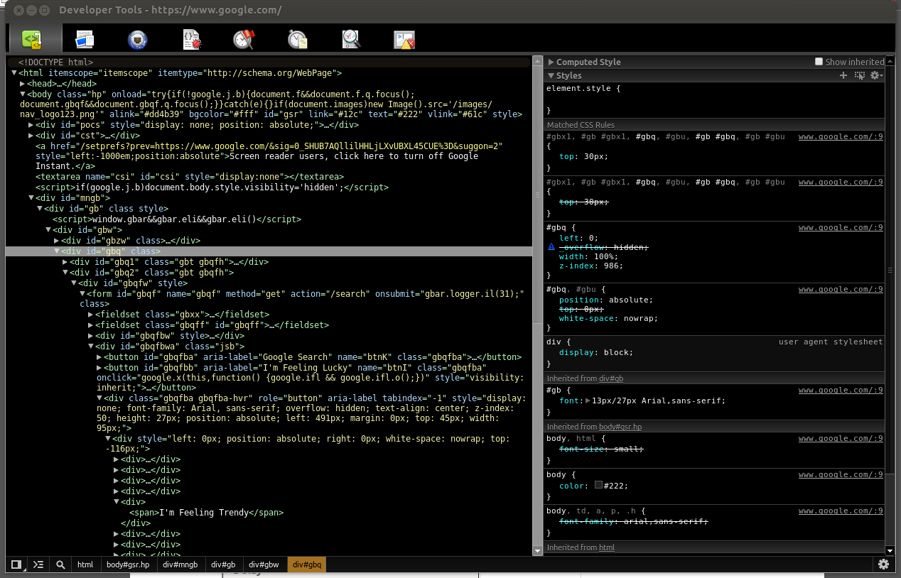
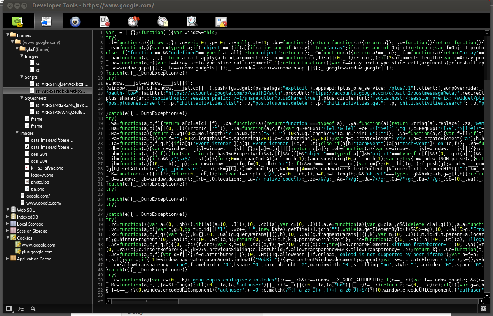
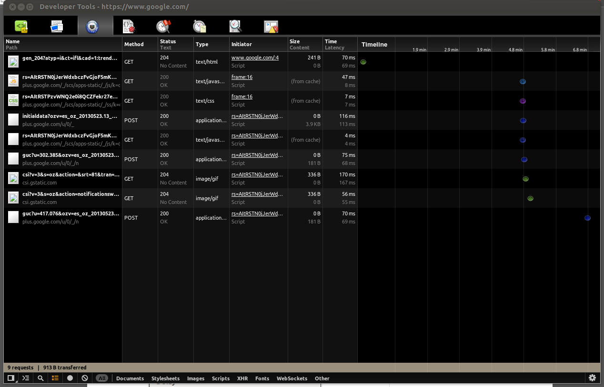

A dark theme for Chrome Developer tools.
========================================

I know there are already a few dark themes out there, but I find most of them to be a little buggy in Ubuntu, and tend to not hold up well when Chrome updates roll out. I tried making this one as simple as possible by basing it on a great theme created by [mohsen1](https://github.com/mohsen1/Chrome-Dev-tools-dark-theme) that inverts all the colors. I find this approach to be much more future-proof than themes that attempt to single-out and rewrite every style.

On top of that theme, I just cleaned up a few things, such as making comments gray and fine-tuning for Ubuntu, specifically around the toolbar.

To install
-----------

There's a custom stylesheet for Chrome that is blank by default. All you need to do is take my Custom.css stylesheet above and either paste into or replace entirely your Custom.css file. Here's where to find it, depending on your OS: 

- Mac: ~/Library/Application Support/Google/Chrome/Default/User\ StyleSheets/Custom.css
- PC: C:UsersYourUsernameAppDataLocalGoogleChromeUser DataDefaultUser StyleSheetsCustom.css
- Ubuntu: ~/.config/chromium/Default/User StyleSheets/Custom.css

Screenshots
-----------

